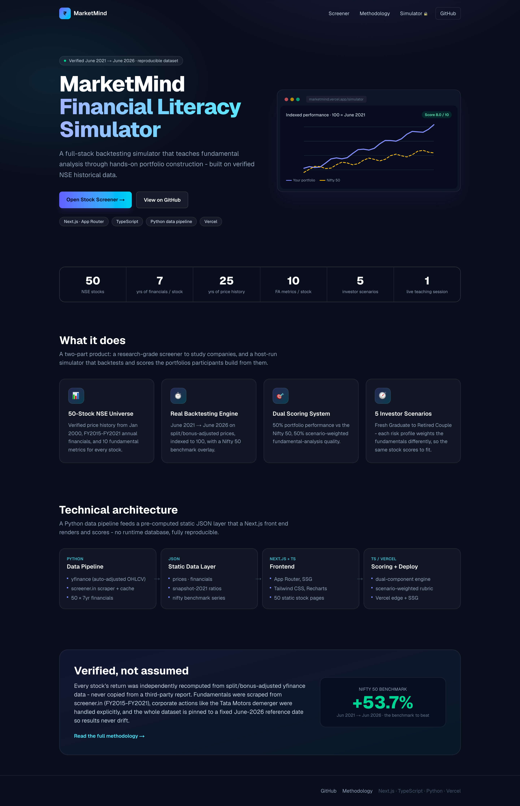
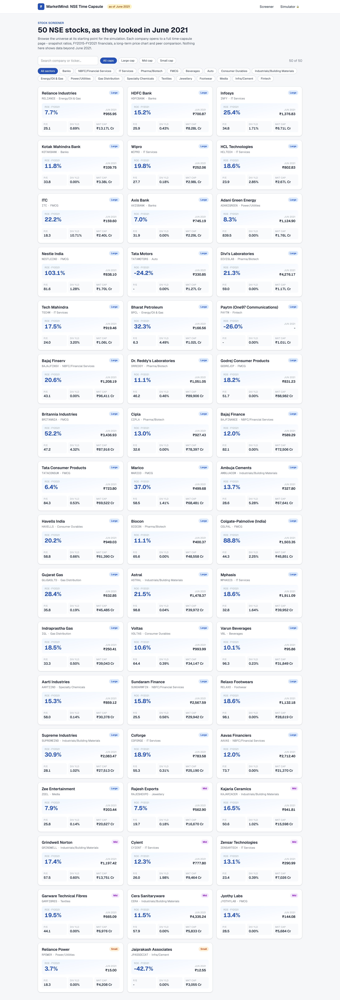
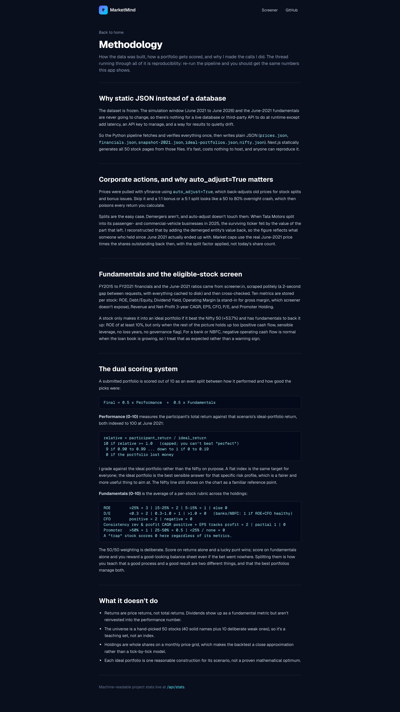
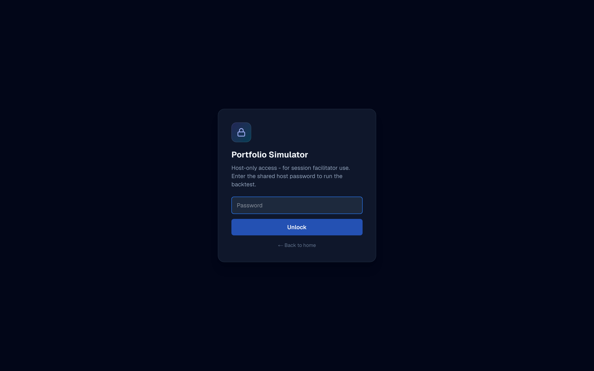

# MarketMind - Financial Literacy Simulator

[](https://nse-time-capsule.vercel.app)
[](https://nextjs.org)
[](https://www.typescriptlang.org)
[](https://www.python.org)
[](https://vercel.com)

**Live demo:** https://nse-time-capsule.vercel.app &nbsp;·&nbsp; [Stock screener](https://nse-time-capsule.vercel.app/screener) &nbsp;·&nbsp; [Portfolio simulator](https://nse-time-capsule.vercel.app/simulator) &nbsp;·&nbsp; [Methodology](https://nse-time-capsule.vercel.app/methodology)

Market Mind was born out of an idea to make a school project on financial literacy interactive, educative, relatable and by leveraging the power of technology. The school assignment required us to pick a topic in finance that is underserved and that can be beneficial to students to learn, regardless of their career choices or professions. I picked the topic of personal investing because I believe every young teen or highschooler should understand the power of money and empower themselves with real world knowledge on how to use the stock market and how to invest. 

Market Mind is a stock-market simulator I built to teach my schoolmates fundamental
analysis, emulating the way the stock market actually works: 
- Research real companies, 
- Build a portfolio for their real-life situation, 
- Find out how the portfolio would have performed, if deployed as a real investment in the market. 
- Learn by doing method deployed to educate fellow school students about the fundamentals of investing in the Indian stock market 


## Overview

Most "learn to invest" tools are either a wall of theory or a play-money game
with no stakes. I wanted something in between. MarketMind freezes the Indian
market at June 2021 and lets you study 50 real NSE companies exactly as they
looked then, with no future data leaking in. You then build a 5-stock portfolio
for an assigned investor (a fresh graduate, a young family, a retired couple,
and so on), and the app backtests it against real June 2021 to June 2026 prices.

The hard part was never the interface. It was getting the data right. Over this
five-year window Indian stocks went through splits, bonus issues, and in one
case (Tata Motors) a full demerger. If you pull raw prices, a 5:1 split shows up
as an 80% overnight crash and every return you compute after that is wrong. So
every figure here was recomputed from split- and bonus-adjusted data,
cross-checked, and then frozen into static files so the numbers never drift.

## Screenshots

| Landing | Stock screener |
|---|---|
| [](https://nse-time-capsule.vercel.app) | [](https://nse-time-capsule.vercel.app/screener) |

| Methodology | Portfolio simulator (host-gated) |
|---|---|
| [](https://nse-time-capsule.vercel.app/methodology) | [](https://nse-time-capsule.vercel.app/simulator) |

## What's in it

- **Stock screener** (`/screener`): the 50-company universe as of June 2021.
  Every stock has a ratio snapshot, annual financials from FY2015 to FY2021, a
  long-term price chart, a peer comparison, and a short plain-English write-up.
  Nothing past June 2021 is shown, so you're judging companies on their track
  record rather than on hindsight.
- **Portfolio simulator** (`/simulator`, password-gated for the host): pick a
  scenario, build a portfolio inside a capital budget, and watch it plotted
  against the Nifty 50 benchmark, with a score out of 10.
- **Scoring**: half the score is how the portfolio actually performed, the other
  half is the quality of the picks. Details below.

## How the data was built

Prices come from yfinance with `auto_adjust=True`, which back-adjusts history
for splits and bonus issues. That one flag is doing a lot of work: without it,
the splits and bonuses in this universe would each read as a sudden crash. Splits
aren't the whole story though. A demerger isn't a split, so yfinance won't fix
it. When Tata Motors split into separate passenger- and commercial-vehicle
companies in 2025, the surviving ticker dropped by the value of the spun-off
business, and I had to add that value back by hand to recover what a
buy-and-hold holder really ended up with.

Fundamentals were scraped from screener.in (FY2015 to FY2021) with a 2-second
delay between requests and on-disk caching so I wasn't hammering the site.
Ten metrics are stored per stock. The Nifty 50 returned **+53.7%** over the
window, and that's the line every portfolio gets measured against.

The whole dataset lives in static JSON rather than a database. Since everything
is pinned to June 2021, the data never changes, so a live database or API would
only add latency, keys to manage, and a way for results to drift. Flat files are
faster, free to host, and reproducible.

## Scoring

```
Final Score (0-10) = 0.5 * Performance + 0.5 * Fundamentals
```

**Performance (0-10)** compares the participant's total return to the Nifty 50
(+53.7% over the window), both indexed to 100 at June 2021:

```
relative = participant_return / nifty_return
score    = 1 + 6 * min(relative, 1.5)   (rounded, capped 1-10)

matching the Nifty  -> ~7      beating it by 50%+ -> 10
half the Nifty      -> ~4      a losing portfolio -> 0
```

**Fundamentals (0-10)** is scenario-specific. Every stock gets five 0-1
sub-scores from its June-2021 numbers, and each scenario weights them
differently before they're averaged across the holdings:

| Sub-score | Built from |
|---|---|
| Growth | ROE + revenue/profit 3yr CAGR (a compounder) |
| Value | P/E — low is better (penalises overpaying) |
| Income | dividend yield |
| Stability | low Debt/Equity + large-cap size + positive cash flow |
| Quality | cash flow + promoter holding + earnings consistency |

```
Fundamentals = 10 * sum( weight[scenario][k] * subscore[k] )
```

| Scenario | Growth | Value | Income | Stability | Quality |
|---|---|---|---|---|---|
| Fresh Graduate | 0.45 | 0.05 | 0.00 | 0.10 | 0.40 |
| Newly Married | 0.35 | 0.10 | 0.05 | 0.15 | 0.35 |
| Young Family | 0.25 | 0.15 | 0.10 | 0.20 | 0.30 |
| Pre-Retirement | 0.10 | 0.20 | 0.20 | 0.25 | 0.25 |
| Elderly Retired | 0.05 | 0.20 | 0.30 | 0.25 | 0.20 |

So a high-ROE, high-P/E compounder scores well for a Fresh Graduate (growth and
quality dominate, valuation barely counts) but poorly for an Elderly Retired
couple (where income, stability and valuation carry the weight). There's no
blocklist — a weak stock just earns low sub-scores, and an expensive-but-good
business can look fine on fundamentals yet still get punished on the performance
half. The 50/50 split is the whole point: I didn't want a lucky punt to win, and
I didn't want good-looking fundamentals to win if the bet went nowhere.
Splitting them forces you to get both the process and the outcome right.

## Architecture

```
  Python pipeline            Static JSON              Next.js app             Vercel
 (run once, offline)        (committed)             (TypeScript)
 ------------------         --------------          ----------------         --------
 yfinance prices       -->  prices.json        -->  /  landing            -->  SSG:
 screener.in fund.          financials.json         /screener  (SSG)            50 stock
 corp-action fixes          snapshot-2021.json      /screener/[ticker]          pages +
 verification passes        nifty.json              /simulator (gated)          edge fns
                                                     /api/stats
```

Scoring runs in a server action behind the host password gate, so results only
reveal when the host runs a submission. Both halves — performance vs the Nifty
and the scenario-weighted fundamentals — are computed purely from the public
snapshot data, so there's no hidden data and the maths is fully explainable.

## Tech stack

| Layer | Choice | Why |
|---|---|---|
| Frontend | Next.js (App Router), TypeScript | static generation for the 50 stock pages; types across the data layer catch mistakes early |
| Styling | Tailwind CSS | quick to iterate, no component-library weight |
| Charts | Recharts | declarative SVG charts, easy to theme |
| Data | Python (yfinance, BeautifulSoup, pandas) | the obvious toolkit for market data and scraping |
| Storage | static JSON | the data is fixed, so a database buys nothing but complexity |
| Hosting | Vercel | painless Next.js deploys |

## Project impact

This shipped as a live Financial Literacy Project session. Teams used the
screener to research companies, built portfolios for an assigned investor
persona, and I revealed their backtested results and scores live, so the lesson
came from real outcomes instead of just a theoretical presentation.

## Running it locally

```bash
git clone https://github.com/arjunprashanth6129/marketmind
cd marketmind
npm install
cp .env.example .env.local      # set SIMULATOR_PASSWORD for the host gate
npm run dev                     # http://localhost:3000
```

`SIMULATOR_PASSWORD` is the only env var; it's the shared password that gates the
host-only `/simulator` page.

## Regenerating the data

The Python scripts in `scripts/` rebuild the static data layer. Run them from the
repo root, in a virtualenv with `yfinance`, `pandas`, `beautifulsoup4`, `lxml`,
and `requests`:

```bash
python scripts/yf_fetch.py            # adjusted prices, returns, splits, shares, dividends
python scripts/screener_fetch.py      # screener.in FY2015-FY2021 fundamentals (cached)
python scripts/build_financials.py    # writes data/financials.json
python scripts/build_snapshot.py      # writes data/snapshot-2021.json
python scripts/fetch_prices.py        # monthly series -> data/prices.json + nifty.json
```

## License

MIT
